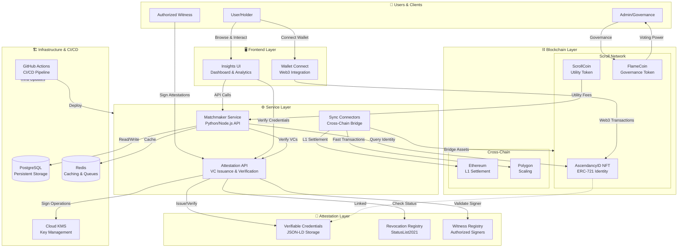
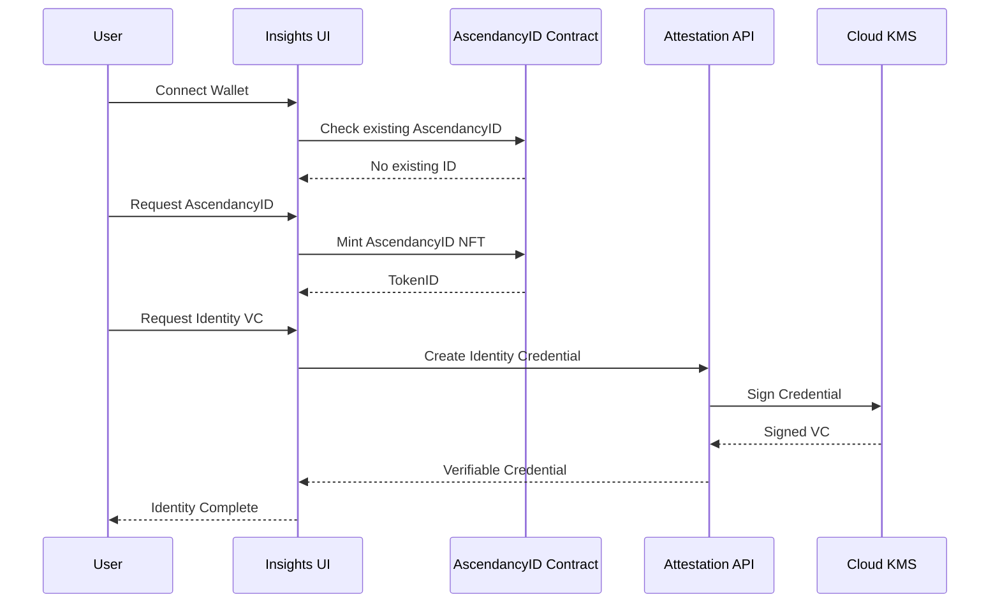
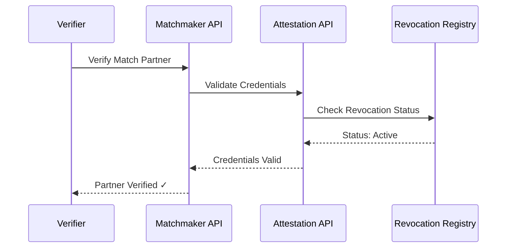

# OTAP Architecture

## Overview

The OmniTech Ascendancy Protocol (OTAP) is a decentralized identity and attestation framework built on the ScrollVerse ecosystem. This document outlines the system architecture and component interactions.

## System Architecture Diagram


```mermaid
flowchart TB
    subgraph Users["👥 Users & Clients"]
        User[User/Holder]
        Witness[Authorized Witness]
        Admin[Admin/Governance]
    end

    subgraph Frontend["🖥️ Frontend Layer"]
        InsightsUI[Insights UI<br/>Dashboard & Analytics]
        WalletConnect[Wallet Connect<br/>Web3 Integration]
    end

    subgraph Services["⚙️ Service Layer"]
        Matchmaker[Matchmaker Service<br/>Python/Node.js API]
        AttestationAPI[Attestation API<br/>VC Issuance & Verification]
        SyncConnectors[Sync Connectors<br/>Cross-Chain Bridge]
    end

    subgraph Blockchain["⛓️ Blockchain Layer"]
        subgraph Scroll["Scroll Network"]
            AscendancyNFT[AscendancyID NFT<br/>ERC-721 Identity]
            ScrollCoin[ScrollCoin<br/>Utility Token]
            FlameCoin[FlameCoin<br/>Governance Token]
        end
        subgraph CrossChain["Cross-Chain"]
            Ethereum[Ethereum<br/>L1 Settlement]
            Polygon[Polygon<br/>Scaling]
        end
    end

    subgraph Attestations["📜 Attestation Layer"]
        VCStore[Verifiable Credentials<br/>JSON-LD Storage]
        RevocationRegistry[Revocation Registry<br/>StatusList2021]
        WitnessRegistry[Witness Registry<br/>Authorized Signers]
    end

    subgraph Infrastructure["🏗️ Infrastructure & CI/CD"]
        Database[(PostgreSQL<br/>Persistent Storage)]
        Cache[(Redis<br/>Caching & Queues)]
        KMS[Cloud KMS<br/>Key Management]
        CICD[GitHub Actions<br/>CI/CD Pipeline]
    end

    %% User Interactions
    User -->|Browse & Interact| InsightsUI
    User -->|Connect Wallet| WalletConnect
    Witness -->|Sign Attestations| AttestationAPI
    Admin -->|Governance| FlameCoin

    %% Frontend to Services
    InsightsUI -->|API Calls| Matchmaker
    InsightsUI -->|Verify Credentials| AttestationAPI
    WalletConnect -->|Web3 Transactions| AscendancyNFT

    %% Service Interactions
    Matchmaker -->|Query Identity| AscendancyNFT
    Matchmaker -->|Verify VCs| AttestationAPI
    Matchmaker -->|Read/Write| Database
    Matchmaker -->|Cache| Cache
    
    AttestationAPI -->|Issue/Verify| VCStore
    AttestationAPI -->|Check Status| RevocationRegistry
    AttestationAPI -->|Validate Signer| WitnessRegistry
    AttestationAPI -->|Sign Operations| KMS

    %% Cross-Chain
    SyncConnectors -->|Bridge Assets| Scroll
    SyncConnectors -->|L1 Settlement| Ethereum
    SyncConnectors -->|Fast Transactions| Polygon

    %% Blockchain Interactions
    AscendancyNFT -.->|Linked| VCStore
    ScrollCoin -->|Utility Fees| Matchmaker
    FlameCoin -->|Voting Power| Admin

    %% CI/CD
    CICD -->|Deploy| Services
    CICD -->|Infra Updates| Infrastructure
```

## Component Descriptions

### 1. AscendancyID NFT Contracts

**Location:** `contracts/`

The core identity layer built on Scroll Network using ERC-721 standard.

| Component | Description |
|-----------|-------------|
| AscendancyID NFT | Soul-bound or transferable identity token |
| Metadata | On-chain/off-chain identity attributes |
| Access Control | Role-based permissions for minting/burning |

**Key Features:**
- Unique identity per wallet address
- Optional soulbound mode (non-transferable)
- Linked to off-chain verifiable credentials
- Governance voting rights via FlameCoin integration

### 2. Matchmaker Service

**Location:** `matchmaker/`

Decentralized coordination layer for identity-based matching.

| Feature | Implementation |
|---------|----------------|
| Discovery API | REST endpoints for finding matches |
| Identity Verification | AscendancyID validation |
| Attestation Check | VC verification integration |
| Webhook System | Event notifications |

**Tech Stack Options:**
- Python (FastAPI) or Node.js (NestJS)
- PostgreSQL for persistence
- Redis for caching

### 3. Insights UI

**Location:** `portal/` (future expansion)

Web-based dashboard for ecosystem interaction.

| Feature | Description |
|---------|-------------|
| Identity Dashboard | View AscendancyID and credentials |
| Match Explorer | Browse and accept matches |
| Attestation Viewer | Verify and display VCs |
| Analytics | Ecosystem metrics and insights |

### 4. Sync Connectors

Cross-chain bridge infrastructure for asset portability.

| Bridge | Networks |
|--------|----------|
| Scroll Bridge | Scroll ↔ Ethereum |
| Polygon Bridge | Scroll ↔ Polygon |
| Asset Bridge | Precious Metals RWA |

### 5. Attestation Layer

**Location:** `attestations/`

W3C-compliant Verifiable Credentials infrastructure.

| Component | Purpose |
|-----------|---------|
| VC Templates | JSON-LD credential formats |
| Issuance API | Create signed credentials |
| Verification | Validate credential signatures |
| Revocation | StatusList2021 registry |

### 6. Infrastructure & CI/CD

**Location:** `infra/`, `.github/workflows/`

| Component | Tool |
|-----------|------|
| IaC | Terraform / Pulumi |
| Container Orchestration | Kubernetes (EKS/GKE/AKS) |
| CI/CD | GitHub Actions |
| Secrets | Cloud KMS + GitHub Secrets |

## Data Flow

### Identity Creation Flow


```mermaid
sequenceDiagram
    participant User
    participant UI as Insights UI
    participant Contract as AscendancyID Contract
    participant API as Attestation API
    participant KMS as Cloud KMS

    User->>UI: Connect Wallet
    UI->>Contract: Check existing AscendancyID
    Contract-->>UI: No existing ID
    User->>UI: Request AscendancyID
    UI->>Contract: Mint AscendancyID NFT
    Contract-->>UI: TokenID #12345
    User->>UI: Request Identity VC
    UI->>API: Create Identity Credential
    API->>KMS: Sign Credential
    KMS-->>API: Signed VC
    API-->>UI: Verifiable Credential
    UI-->>User: Identity Complete
```

### Attestation Verification Flow


```mermaid
sequenceDiagram
    participant Verifier
    participant API as Matchmaker API
    participant Attest as Attestation API
    participant Registry as Revocation Registry

    Verifier->>API: Verify Match Partner
    API->>Attest: Validate Credentials
    Attest->>Registry: Check Revocation Status
    Registry-->>Attest: Status: Active
    Attest-->>API: Credentials Valid
    API-->>Verifier: Partner Verified ✓
```

## Security Architecture

### Defense in Depth

```
┌─────────────────────────────────────────────────────────┐
│                    WAF / DDoS Protection                │
├─────────────────────────────────────────────────────────┤
│                    TLS 1.3 Encryption                   │
├─────────────────────────────────────────────────────────┤
│              API Gateway (Rate Limiting)                │
├─────────────────────────────────────────────────────────┤
│           Authentication (JWT / Web3 Sig)               │
├─────────────────────────────────────────────────────────┤
│              Authorization (RBAC / ABAC)                │
├─────────────────────────────────────────────────────────┤
│                  Application Layer                      │
├─────────────────────────────────────────────────────────┤
│           Database (Encrypted at Rest)                  │
├─────────────────────────────────────────────────────────┤
│                 Network Isolation                       │
└─────────────────────────────────────────────────────────┘
```

### Key Management

- **Development:** Local keys, test networks only
- **Staging:** Cloud KMS with limited access
- **Production:** HSM-backed keys, strict IAM policies

## Deployment Environments

| Environment | Purpose | Infrastructure |
|-------------|---------|----------------|
| Development | Local testing | Docker Compose |
| Staging | Integration testing | Kubernetes (single node) |
| Production | Live system | Kubernetes (multi-AZ) |

## Future Roadmap

1. **Phase 1 (Current):** Core scaffolding and documentation
2. **Phase 2:** Matchmaker MVP and basic attestations
3. **Phase 3:** Cross-chain sync connectors
4. **Phase 4:** Full Insights UI dashboard
5. **Phase 5:** Governance and DAO integration

---

*Document Version: 1.0.0*
*Last Updated: 2025-11-26*
*Part of the OmniTech Ascendancy Protocol (OTAP)*
# Architecture

This document outlines the architecture of the OmniBuilderZero project.

## Overview
The OmniBuilderZero is designed to provide a robust solution for building and managing applications efficiently. It utilizes microservices architecture to enhance scalability and maintainability.

## Components
- **Frontend**: Developed using React.js.
- **Backend**: Built with Node.js and Express.
- **Database**: MongoDB for data storage.
- **Authentication**: JSON Web Tokens (JWT) for securing endpoints.

## Deployment
The application is deployed on AWS using Docker containers for better resource management.
