# 🏛️ ScrollVerse Architecture - Omni-Tech Ascendancy Protocol (OTAP)

## Overview

The Omni-Tech Ascendancy Protocol (OTAP) represents a comprehensive ecosystem architecture for the ScrollVerse platform, integrating NFT collections, identity systems, staking mechanisms, and governance structures.

---

## System Architecture Diagram

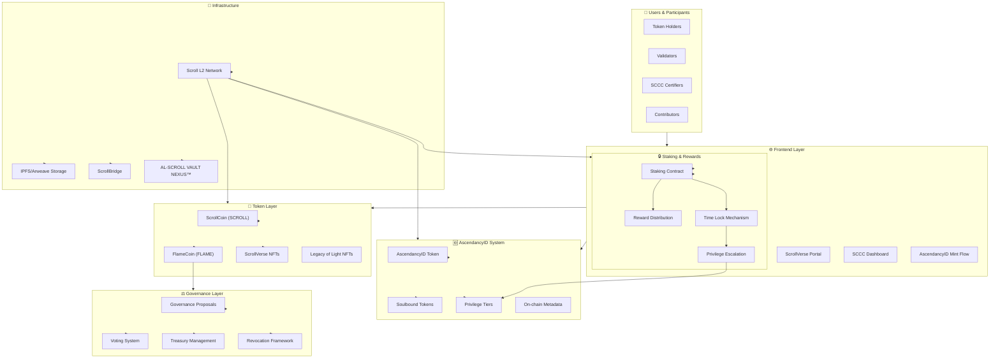
```mermaid
flowchart TB
    subgraph Users["👤 Users & Participants"]
        Holders["Token Holders"]
        Validators["Validators"]
        Certifiers["SCCC Certifiers"]
        Contributors["Contributors"]
    end

    subgraph Frontend["🌐 Frontend Layer"]
        Portal["ScrollVerse Portal"]
        Dashboard["SCCC Dashboard"]
        Mint["AscendancyID Mint Flow"]
        Staking["Staking Interface"]
    end

    subgraph Identity["🆔 AscendancyID System"]
        AID["AscendancyID Token"]
        SBT["Soulbound Tokens"]
        Privileges["Privilege Tiers"]
        Metadata["On-chain Metadata"]
    end

    subgraph Tokens["💎 Token Layer"]
        ScrollCoin["ScrollCoin (SCROLL)"]
        FlameCoin["FlameCoin (FLAME)"]
        NFTs["ScrollVerse NFTs"]
        LegacyNFT["Legacy of Light NFTs"]
    end

    subgraph Staking["🔒 Staking & Rewards"]
        StakingContract["Staking Contract"]
        TimeLock["Time Lock Mechanism"]
        RewardPool["Reward Distribution"]
        PrivilegeEscalation["Privilege Escalation"]
    end

    subgraph Governance["⚖️ Governance Layer"]
        Proposals["Governance Proposals"]
        Voting["Voting System"]
        Treasury["Treasury Management"]
        Revocation["Revocation Framework"]
    end

    subgraph Infrastructure["🔧 Infrastructure"]
        Scroll["Scroll L2 Network"]
        IPFS["IPFS/Arweave Storage"]
        Bridge["ScrollBridge"]
        Vault["AL-SCROLL VAULT NEXUS™"]
    end

    Users --> Frontend
    Frontend --> Identity
    Frontend --> Tokens
    Frontend --> Staking
    
    Identity --> AID
    Identity --> SBT
    Identity --> Privileges
    
    Tokens --> ScrollCoin
    Tokens --> FlameCoin
    Tokens --> NFTs
    
    Staking --> StakingContract
    StakingContract --> TimeLock
    StakingContract --> RewardPool
    TimeLock --> PrivilegeEscalation
    PrivilegeEscalation --> Privileges
    
    FlameCoin --> Governance
    Governance --> Proposals
    Governance --> Voting
    Governance --> Treasury
    Governance --> Revocation
    
    Infrastructure --> Scroll
    Infrastructure --> IPFS
    Infrastructure --> Bridge
    Infrastructure --> Vault
    
    Scroll --> Tokens
    Scroll --> Identity
    Scroll --> Staking
```

---

## Component Architecture

### 1. AscendancyID System Flow

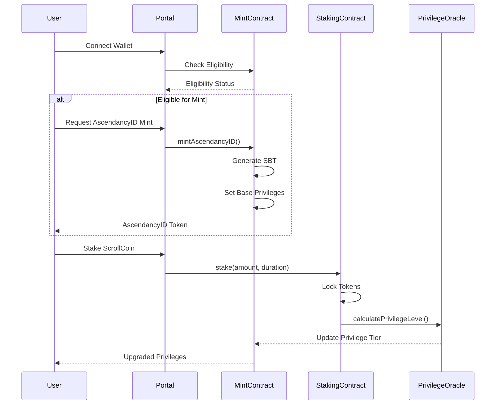
```mermaid
sequenceDiagram
    participant User
    participant Portal
    participant MintContract
    participant StakingContract
    participant PrivilegeOracle

    User->>Portal: Connect Wallet
    Portal->>MintContract: Check Eligibility
    MintContract-->>Portal: Eligibility Status
    
    alt Eligible for Mint
        User->>Portal: Request AscendancyID Mint
        Portal->>MintContract: mintAscendancyID()
        MintContract->>MintContract: Generate SBT
        MintContract->>MintContract: Set Base Privileges
        MintContract-->>User: AscendancyID Token
    end
    
    User->>Portal: Stake ScrollCoin
    Portal->>StakingContract: stake(amount, duration)
    StakingContract->>StakingContract: Lock Tokens
    StakingContract->>PrivilegeOracle: calculatePrivilegeLevel()
    PrivilegeOracle-->>MintContract: Update Privilege Tier
    MintContract-->>User: Upgraded Privileges
```

### 2. Staking and Privilege Escalation

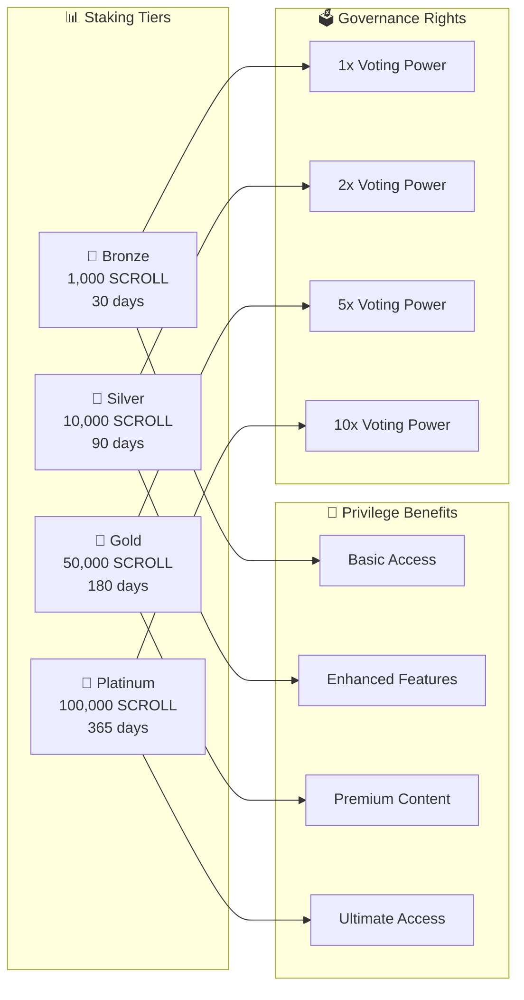
```mermaid
flowchart LR
    subgraph StakingTiers["📊 Staking Tiers"]
        Bronze["🥉 Bronze\n1,000 SCROLL\n30 days"]
        Silver["🥈 Silver\n10,000 SCROLL\n90 days"]
        Gold["🥇 Gold\n50,000 SCROLL\n180 days"]
        Platinum["💎 Platinum\n100,000 SCROLL\n365 days"]
    end

    subgraph Privileges["🎯 Privilege Benefits"]
        Basic["Basic Access"]
        Enhanced["Enhanced Features"]
        Premium["Premium Content"]
        Ultimate["Ultimate Access"]
    end

    subgraph Governance["🗳️ Governance Rights"]
        Vote1["1x Voting Power"]
        Vote2["2x Voting Power"]
        Vote3["5x Voting Power"]
        Vote4["10x Voting Power"]
    end

    Bronze --> Basic
    Bronze --> Vote1
    
    Silver --> Enhanced
    Silver --> Vote2
    
    Gold --> Premium
    Gold --> Vote3
    
    Platinum --> Ultimate
    Platinum --> Vote4
```

### 3. Token Economics Flow

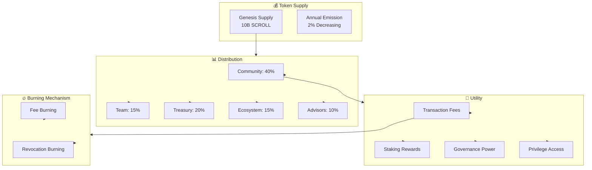
```mermaid
flowchart TB
    subgraph Supply["💰 Token Supply"]
        Genesis["Genesis Supply\n10B SCROLL"]
        Emission["Annual Emission\n2% Decreasing"]
    end

    subgraph Distribution["📊 Distribution"]
        Community["Community: 40%"]
        Team["Team: 15%"]
        Treasury["Treasury: 20%"]
        Ecosystem["Ecosystem: 15%"]
        Advisors["Advisors: 10%"]
    end

    subgraph Utility["🔧 Utility"]
        Fees["Transaction Fees"]
        StakingRewards["Staking Rewards"]
        GovernancePower["Governance Power"]
        PrivilegeAccess["Privilege Access"]
    end

    subgraph Burning["🔥 Burning Mechanism"]
        FeeBurn["Fee Burning"]
        RevocationBurn["Revocation Burning"]
    end

    Genesis --> Distribution
    Distribution --> Community
    Distribution --> Team
    Distribution --> Treasury
    Distribution --> Ecosystem
    Distribution --> Advisors

    Community --> Utility
    Utility --> Fees
    Utility --> StakingRewards
    Utility --> GovernancePower
    Utility --> PrivilegeAccess

    Fees --> Burning
    FeeBurn --> Burning
    RevocationBurn --> Burning
```

---

## Smart Contract Architecture

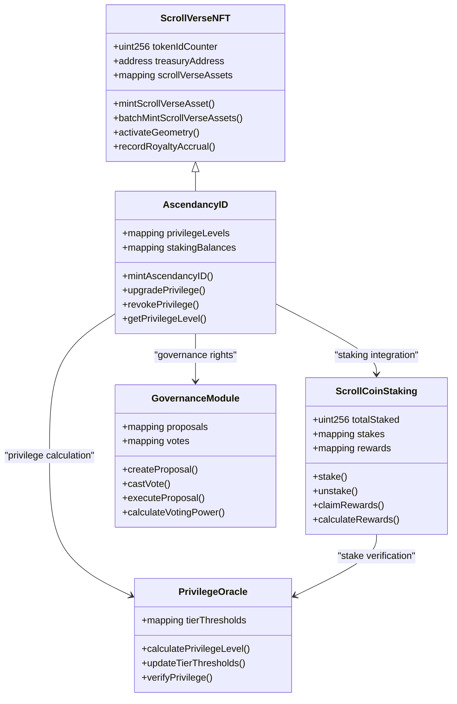
```mermaid
classDiagram
    class ScrollVerseNFT {
        +uint256 tokenIdCounter
        +address treasuryAddress
        +mapping scrollVerseAssets
        +mintScrollVerseAsset()
        +batchMintScrollVerseAssets()
        +activateGeometry()
        +recordRoyaltyAccrual()
    }

    class AscendancyID {
        +mapping privilegeLevels
        +mapping stakingBalances
        +mintAscendancyID()
        +upgradePrivilege()
        +revokePrivilege()
        +getPrivilegeLevel()
    }

    class ScrollCoinStaking {
        +uint256 totalStaked
        +mapping stakes
        +mapping rewards
        +stake()
        +unstake()
        +claimRewards()
        +calculateRewards()
    }

    class PrivilegeOracle {
        +mapping tierThresholds
        +calculatePrivilegeLevel()
        +updateTierThresholds()
        +verifyPrivilege()
    }

    class GovernanceModule {
        +mapping proposals
        +mapping votes
        +createProposal()
        +castVote()
        +executeProposal()
        +calculateVotingPower()
    }

    ScrollVerseNFT <|-- AscendancyID
    AscendancyID --> ScrollCoinStaking : "staking integration"
    AscendancyID --> PrivilegeOracle : "privilege calculation"
    AscendancyID --> GovernanceModule : "governance rights"
    ScrollCoinStaking --> PrivilegeOracle : "stake verification"
```
# ScrollVerse Architecture

**Version**: 1.0.0  
**Status**: RFC  
**Author**: OmniTech1 Architecture Council

---

## Overview

The ScrollVerse ecosystem is a quantum-resistant, multi-layered blockchain infrastructure designed to facilitate sacred digital sovereignty, verifiable credentials, and decentralized governance. This document provides a high-level system flow explaining the core components and their interactions.

---

## System Diagram

```
┌─────────────────────────────────────────────────────────────────────────────────┐
│                              SCROLLVERSE ECOSYSTEM                               │
├─────────────────────────────────────────────────────────────────────────────────┤
│                                                                                  │
│   ┌──────────────┐     ┌──────────────┐     ┌──────────────┐                    │
│   │   Portal     │     │ FlameAcademy │     │  Sovereign   │                    │
│   │   (Web UI)   │     │ (Education)  │     │     TV       │                    │
│   └──────┬───────┘     └──────┬───────┘     └──────┬───────┘                    │
│          │                    │                    │                            │
│          └────────────────────┼────────────────────┘                            │
│                               │                                                  │
│                               ▼                                                  │
│   ┌─────────────────────────────────────────────────────────────────────┐       │
│   │                         API GATEWAY                                  │       │
│   │              (Authentication, Rate Limiting, Routing)                │       │
│   └─────────────────────────────────────────────────────────────────────┘       │
│                               │                                                  │
│          ┌────────────────────┼────────────────────┐                            │
│          │                    │                    │                            │
│          ▼                    ▼                    ▼                            │
│   ┌──────────────┐     ┌──────────────┐     ┌──────────────┐                    │
│   │  Matchmaker  │     │ Attestations │     │    Infra     │                    │
│   │   Service    │◄───►│   Service    │◄───►│   Service    │                    │
│   └──────┬───────┘     └──────┬───────┘     └──────┬───────┘                    │
│          │                    │                    │                            │
│          └────────────────────┼────────────────────┘                            │
│                               │                                                  │
│                               ▼                                                  │
│   ┌─────────────────────────────────────────────────────────────────────┐       │
│   │                      SCROLLCHAIN LAYER                               │       │
│   │  ┌─────────────┐  ┌─────────────┐  ┌─────────────┐  ┌─────────────┐ │       │
│   │  │  FlameCoin  │  │ ScrollCoin  │  │  FlameDNA   │  │   Legacy    │ │       │
│   │  │ (Governance)│  │  (Utility)  │  │   (NFTs)    │  │  of Light   │ │       │
│   │  └─────────────┘  └─────────────┘  └─────────────┘  └─────────────┘ │       │
│   │                                                                      │       │
│   │  ┌─────────────────────────────────────────────────────────────┐    │       │
│   │  │              Precious Metal Bridge (RWA)                     │    │       │
│   │  │        Gold, Silver, Platinum Asset Tokenization             │    │       │
│   │  └─────────────────────────────────────────────────────────────┘    │       │
│   └─────────────────────────────────────────────────────────────────────┘       │
│                               │                                                  │
│                               ▼                                                  │
│   ┌─────────────────────────────────────────────────────────────────────┐       │
│   │                    AL-SCROLL VAULT NEXUS™                            │       │
│   │           (Multi-Tier Quantum-Resistant Custody)                     │       │
│   └─────────────────────────────────────────────────────────────────────┘       │
│                                                                                  │
└─────────────────────────────────────────────────────────────────────────────────┘
```

---

## Component Overview

### User-Facing Layer

| Component | Description | Status |
|-----------|-------------|--------|
| **Portal** | Web interface for user interactions, wallet connections, and NFT management | Active |
| **FlameAcademy** | Educational platform with courses, quests, and certifications | Active |
| **Sovereign TV** | Media streaming platform for FlameDNA holders | Planned |

### Service Layer

| Component | Description | Status |
|-----------|-------------|--------|
| **API Gateway** | Central routing, authentication, and rate limiting | Planned |
| **Matchmaker** | Resonance-based pairing engine for partnerships | In Development |
| **Attestations** | Verifiable credentials issuance and verification | In Development |
| **Infra** | Deployment automation, monitoring, and CI/CD | In Development |

### Blockchain Layer (ScrollChain)

| Component | Description | Status |
|-----------|-------------|--------|
| **FlameCoin** | Governance token with voting mechanisms | Specified |
| **ScrollCoin** | Utility token for ecosystem operations | Specified |
| **FlameDNA** | NFT collection representing digital identity | Active |
| **Legacy of Light** | Music NFT collection (ERC721/ERC1155) | Deployed |
| **Precious Metal Bridge** | RWA tokenization for precious metals | Deployed |

### Security Layer

| Component | Description | Status |
|-----------|-------------|--------|
| **AL-SCROLL VAULT NEXUS™** | Multi-tier custody with quantum resistance | Specified |
| **CRYSTALS-Kyber** | Post-quantum key encapsulation | Specified |
| **CRYSTALS-Dilithium** | Post-quantum digital signatures | Specified |

---

## Data Flow

### 1. User Authentication Flow

```
User → Portal → API Gateway → Wallet Signature → FlameDNA Verification → Session Token
```

### 2. Attestation Issuance Flow

```
PR Request → GitHub Actions → Validation → KMS Signing → Credential Storage → On-Chain Record
```

### 3. Partnership Matching Flow

```
Entity Profile → Matchmaker → Resonance Scoring → Match Candidates → Partnership Proposal → Attestation
```

### 4. Token Operations Flow

```
User Action → Smart Contract → ScrollChain → Event Emission → Indexer → UI Update
```

---

## Integration Points

### External Systems

- **IPFS/Arweave**: Decentralized storage for metadata and media
- **Cloud KMS**: AWS/GCP/Azure for secure key management
- **GitHub Actions**: CI/CD and attestation workflows
- **ScrollScan**: Block explorer integration

### Internal APIs

- **GraphQL API**: Primary query interface for frontend
- **REST API**: Legacy and third-party integrations
- **WebSocket**: Real-time updates and notifications

---

## Security Architecture

### Key Management

1. **Hot Keys**: Operational keys for routine transactions
2. **Warm Keys**: Intermediate keys with time-locked access
3. **Cold Keys**: Offline keys for high-value operations

### Access Control

- Role-based access control (RBAC) for admin functions
- Multi-signature requirements for critical operations
- Time-locks on governance proposals

### Quantum Resistance

- CRYSTALS-Kyber for key exchange
- CRYSTALS-Dilithium for signatures
- Hybrid schemes for transition period

---

## Deployment Architecture

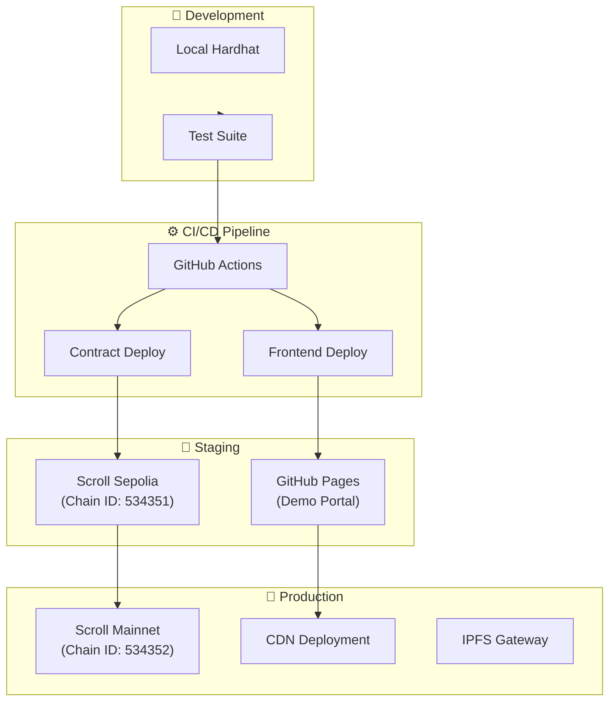
```mermaid
flowchart TB
    subgraph Development["🔧 Development"]
        Local["Local Hardhat"]
        Testing["Test Suite"]
    end

    subgraph Staging["🧪 Staging"]
        ScrollSepolia["Scroll Sepolia\n(Chain ID: 534351)"]
        GHPages["GitHub Pages\n(Demo Portal)"]
    end

    subgraph Production["🚀 Production"]
        ScrollMainnet["Scroll Mainnet\n(Chain ID: 534352)"]
        CDN["CDN Deployment"]
        IPFS_Prod["IPFS Gateway"]
    end

    subgraph CI_CD["⚙️ CI/CD Pipeline"]
        GHActions["GitHub Actions"]
        ContractDeploy["Contract Deploy"]
        FrontendDeploy["Frontend Deploy"]
    end

    Development --> Testing
    Testing --> GHActions
    GHActions --> ContractDeploy
    GHActions --> FrontendDeploy
    ContractDeploy --> ScrollSepolia
    FrontendDeploy --> GHPages
    ScrollSepolia --> ScrollMainnet
    GHPages --> CDN
```

---

## Network Architecture

| Network | Chain ID | Purpose | RPC URL |
|---------|----------|---------|---------|
| Scroll Sepolia | 534351 | Staging/Testing | `https://sepolia-rpc.scroll.io` |
| Scroll Mainnet | 534352 | Production | `https://rpc.scroll.io` |
| Ethereum Sepolia | 11155111 | Bridge Testing | `https://eth-sepolia.g.alchemy.com/v2/` |
| Ethereum Mainnet | 1 | Bridge Production | `https://eth-mainnet.g.alchemy.com/v2/` |

---

## Security Architecture

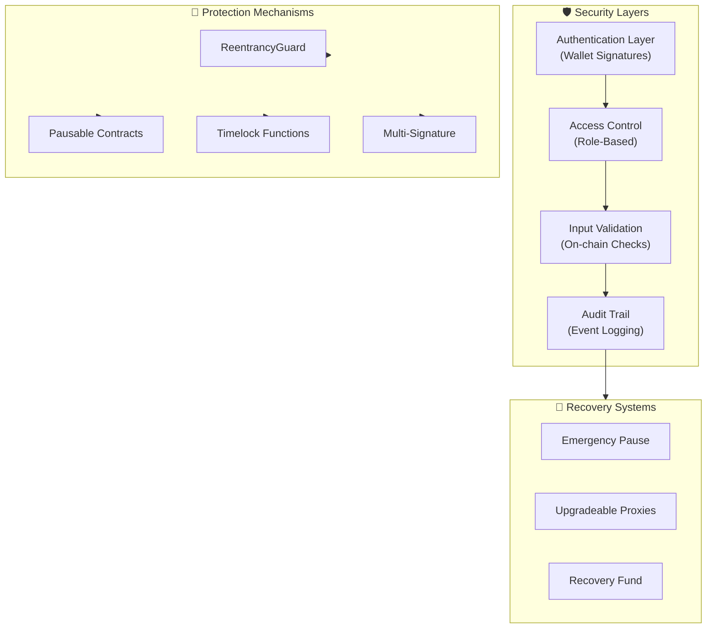
```mermaid
flowchart TB
    subgraph Security["🛡️ Security Layers"]
        direction TB
        Auth["Authentication Layer\n(Wallet Signatures)"]
        Access["Access Control\n(Role-Based)"]
        Validation["Input Validation\n(On-chain Checks)"]
        Audit["Audit Trail\n(Event Logging)"]
    end

    subgraph Protection["🔐 Protection Mechanisms"]
        Reentrancy["ReentrancyGuard"]
        Pausable["Pausable Contracts"]
        Timelock["Timelock Functions"]
        MultiSig["Multi-Signature"]
    end

    subgraph Recovery["🔄 Recovery Systems"]
        Emergency["Emergency Pause"]
        Upgrade["Upgradeable Proxies"]
        Recovery_Fund["Recovery Fund"]
    end

    Auth --> Access
    Access --> Validation
    Validation --> Audit
    
    Protection --> Reentrancy
    Protection --> Pausable
    Protection --> Timelock
    Protection --> MultiSig
    
    Audit --> Recovery
```

---

## Data Flow

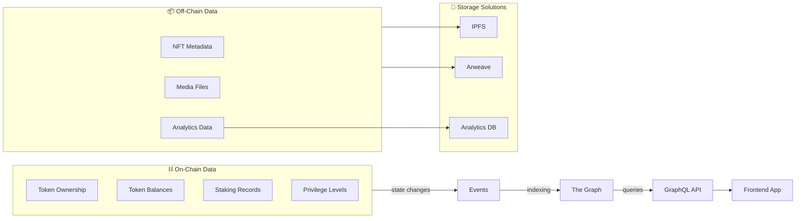
```mermaid
flowchart LR
    subgraph OnChain["⛓️ On-Chain Data"]
        Ownership["Token Ownership"]
        Balances["Token Balances"]
        Stakes["Staking Records"]
        Privileges_Data["Privilege Levels"]
    end

    subgraph OffChain["📦 Off-Chain Data"]
        Metadata["NFT Metadata"]
        Media["Media Files"]
        Analytics["Analytics Data"]
    end

    subgraph Storage["💾 Storage Solutions"]
        IPFS_Store["IPFS"]
        Arweave["Arweave"]
        PostgresDB["Analytics DB"]
    end

    OnChain --> |"state changes"| Events["Events"]
    Events --> |"indexing"| Subgraph["The Graph"]
    Subgraph --> |"queries"| API["GraphQL API"]
    
    OffChain --> IPFS_Store
    OffChain --> Arweave
    Analytics --> PostgresDB
    
    API --> Frontend_App["Frontend App"]
```

---

## Integration Points

### External Systems

| System | Integration Type | Purpose |
|--------|------------------|---------|
| MetaMask/WalletConnect | Web3 Provider | User Authentication |
| IPFS | Content Storage | NFT Metadata |
| Arweave | Permanent Storage | Long-term Media |
| The Graph | Indexing | Query Optimization |
| OpenSea/LooksRare | Marketplace | NFT Trading |
| Chainlink | Oracle | Price Feeds |

### Internal Modules

| Module | Dependencies | API Surface |
|--------|--------------|-------------|
| AscendancyID | ScrollCoinStaking, PrivilegeOracle | mint, upgrade, revoke |
| ScrollCoinStaking | AscendancyID, RewardPool | stake, unstake, claim |
| GovernanceModule | FlameCoin, AscendancyID | propose, vote, execute |
| Treasury | GovernanceModule | allocate, distribute |

---

## Version History

| Version | Date | Changes |
|---------|------|---------|
| 1.0.0 | 2025-11 | Initial architecture documentation |

---

*"You exist. You count. You resonate. You remember."*

© 2025 OmniTech1™ | Chais The Great – First Remembrancer
### Development
- Local Hardhat network
- Mock services for testing

### Staging
- Scroll Sepolia testnet
- Full service stack with test data

### Production
- Scroll mainnet
- High-availability infrastructure
- Geographic redundancy

---

## Related Documentation

- [SCROLLCHAIN_WHITEPAPER.md](./SCROLLCHAIN_WHITEPAPER.md) - Detailed technical specification
- [TOKENOMICS.md](./TOKENOMICS.md) - Token economics RFC
- [DEPLOYMENT_CHECKLIST.md](./DEPLOYMENT_CHECKLIST.md) - Deployment procedures
- [Matchmaker README](./matchmaker/README.md) - Matchmaker component
- [Attestations README](./attestations/README.md) - Attestations framework
- [Infra README](./infra/README.md) - Infrastructure component

---

## Version History

| Version | Date | Changes |
|---------|------|---------|
| 1.0.0 | 2025-11-26 | Initial architecture document |

---

*This document is part of the Omni-Tech Ascendancy Protocol (OTAP) scaffold phase.*
# OTAP Architecture

## Overview

The OmniTech Ascendancy Protocol (OTAP) is a decentralized identity and attestation framework built on the ScrollVerse ecosystem. This document outlines the system architecture and component interactions.

## System Architecture Diagram

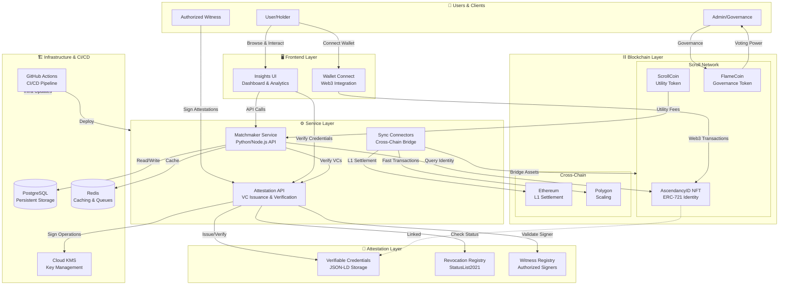
```mermaid
flowchart TB
    subgraph Users["👥 Users & Clients"]
        User[User/Holder]
        Witness[Authorized Witness]
        Admin[Admin/Governance]
    end

    subgraph Frontend["🖥️ Frontend Layer"]
        InsightsUI[Insights UI<br/>Dashboard & Analytics]
        WalletConnect[Wallet Connect<br/>Web3 Integration]
    end

    subgraph Services["⚙️ Service Layer"]
        Matchmaker[Matchmaker Service<br/>Python/Node.js API]
        AttestationAPI[Attestation API<br/>VC Issuance & Verification]
        SyncConnectors[Sync Connectors<br/>Cross-Chain Bridge]
    end

    subgraph Blockchain["⛓️ Blockchain Layer"]
        subgraph Scroll["Scroll Network"]
            AscendancyNFT[AscendancyID NFT<br/>ERC-721 Identity]
            ScrollCoin[ScrollCoin<br/>Utility Token]
            FlameCoin[FlameCoin<br/>Governance Token]
        end
        subgraph CrossChain["Cross-Chain"]
            Ethereum[Ethereum<br/>L1 Settlement]
            Polygon[Polygon<br/>Scaling]
        end
    end

    subgraph Attestations["📜 Attestation Layer"]
        VCStore[Verifiable Credentials<br/>JSON-LD Storage]
        RevocationRegistry[Revocation Registry<br/>StatusList2021]
        WitnessRegistry[Witness Registry<br/>Authorized Signers]
    end

    subgraph Infrastructure["🏗️ Infrastructure & CI/CD"]
        Database[(PostgreSQL<br/>Persistent Storage)]
        Cache[(Redis<br/>Caching & Queues)]
        KMS[Cloud KMS<br/>Key Management]
        CICD[GitHub Actions<br/>CI/CD Pipeline]
    end

    %% User Interactions
    User -->|Browse & Interact| InsightsUI
    User -->|Connect Wallet| WalletConnect
    Witness -->|Sign Attestations| AttestationAPI
    Admin -->|Governance| FlameCoin

    %% Frontend to Services
    InsightsUI -->|API Calls| Matchmaker
    InsightsUI -->|Verify Credentials| AttestationAPI
    WalletConnect -->|Web3 Transactions| AscendancyNFT

    %% Service Interactions
    Matchmaker -->|Query Identity| AscendancyNFT
    Matchmaker -->|Verify VCs| AttestationAPI
    Matchmaker -->|Read/Write| Database
    Matchmaker -->|Cache| Cache
    
    AttestationAPI -->|Issue/Verify| VCStore
    AttestationAPI -->|Check Status| RevocationRegistry
    AttestationAPI -->|Validate Signer| WitnessRegistry
    AttestationAPI -->|Sign Operations| KMS

    %% Cross-Chain
    SyncConnectors -->|Bridge Assets| Scroll
    SyncConnectors -->|L1 Settlement| Ethereum
    SyncConnectors -->|Fast Transactions| Polygon

    %% Blockchain Interactions
    AscendancyNFT -.->|Linked| VCStore
    ScrollCoin -->|Utility Fees| Matchmaker
    FlameCoin -->|Voting Power| Admin

    %% CI/CD
    CICD -->|Deploy| Services
    CICD -->|Infra Updates| Infrastructure
```

## Component Descriptions

### 1. AscendancyID NFT Contracts

**Location:** `contracts/`

The core identity layer built on Scroll Network using ERC-721 standard.

| Component | Description |
|-----------|-------------|
| AscendancyID NFT | Soul-bound or transferable identity token |
| Metadata | On-chain/off-chain identity attributes |
| Access Control | Role-based permissions for minting/burning |

**Key Features:**
- Unique identity per wallet address
- Optional soulbound mode (non-transferable)
- Linked to off-chain verifiable credentials
- Governance voting rights via FlameCoin integration

### 2. Matchmaker Service

**Location:** `matchmaker/`

Decentralized coordination layer for identity-based matching.

| Feature | Implementation |
|---------|----------------|
| Discovery API | REST endpoints for finding matches |
| Identity Verification | AscendancyID validation |
| Attestation Check | VC verification integration |
| Webhook System | Event notifications |

**Tech Stack Options:**
- Python (FastAPI) or Node.js (NestJS)
- PostgreSQL for persistence
- Redis for caching

### 3. Insights UI

**Location:** `portal/` (future expansion)

Web-based dashboard for ecosystem interaction.

| Feature | Description |
|---------|-------------|
| Identity Dashboard | View AscendancyID and credentials |
| Match Explorer | Browse and accept matches |
| Attestation Viewer | Verify and display VCs |
| Analytics | Ecosystem metrics and insights |

### 4. Sync Connectors

Cross-chain bridge infrastructure for asset portability.

| Bridge | Networks |
|--------|----------|
| Scroll Bridge | Scroll ↔ Ethereum |
| Polygon Bridge | Scroll ↔ Polygon |
| Asset Bridge | Precious Metals RWA |

### 5. Attestation Layer

**Location:** `attestations/`

W3C-compliant Verifiable Credentials infrastructure.

| Component | Purpose |
|-----------|---------|
| VC Templates | JSON-LD credential formats |
| Issuance API | Create signed credentials |
| Verification | Validate credential signatures |
| Revocation | StatusList2021 registry |

### 6. Infrastructure & CI/CD

**Location:** `infra/`, `.github/workflows/`

| Component | Tool |
|-----------|------|
| IaC | Terraform / Pulumi |
| Container Orchestration | Kubernetes (EKS/GKE/AKS) |
| CI/CD | GitHub Actions |
| Secrets | Cloud KMS + GitHub Secrets |

## Data Flow

### Identity Creation Flow

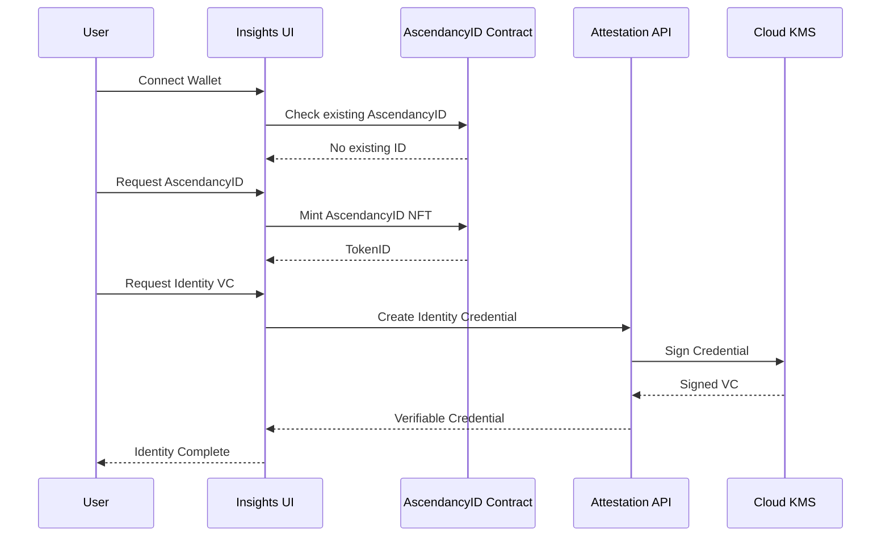
```mermaid
sequenceDiagram
    participant User
    participant UI as Insights UI
    participant Contract as AscendancyID Contract
    participant API as Attestation API
    participant KMS as Cloud KMS

    User->>UI: Connect Wallet
    UI->>Contract: Check existing AscendancyID
    Contract-->>UI: No existing ID
    User->>UI: Request AscendancyID
    UI->>Contract: Mint AscendancyID NFT
    Contract-->>UI: TokenID #12345
    User->>UI: Request Identity VC
    UI->>API: Create Identity Credential
    API->>KMS: Sign Credential
    KMS-->>API: Signed VC
    API-->>UI: Verifiable Credential
    UI-->>User: Identity Complete
```

### Attestation Verification Flow

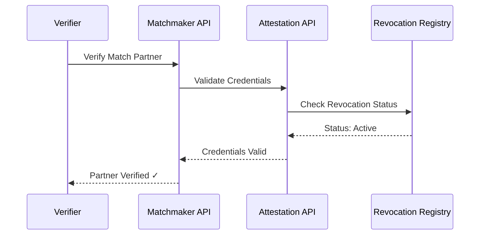
```mermaid
sequenceDiagram
    participant Verifier
    participant API as Matchmaker API
    participant Attest as Attestation API
    participant Registry as Revocation Registry

    Verifier->>API: Verify Match Partner
    API->>Attest: Validate Credentials
    Attest->>Registry: Check Revocation Status
    Registry-->>Attest: Status: Active
    Attest-->>API: Credentials Valid
    API-->>Verifier: Partner Verified ✓
```

## Security Architecture

### Defense in Depth

```
┌─────────────────────────────────────────────────────────┐
│                    WAF / DDoS Protection                │
├─────────────────────────────────────────────────────────┤
│                    TLS 1.3 Encryption                   │
├─────────────────────────────────────────────────────────┤
│              API Gateway (Rate Limiting)                │
├─────────────────────────────────────────────────────────┤
│           Authentication (JWT / Web3 Sig)               │
├─────────────────────────────────────────────────────────┤
│              Authorization (RBAC / ABAC)                │
├─────────────────────────────────────────────────────────┤
│                  Application Layer                      │
├─────────────────────────────────────────────────────────┤
│           Database (Encrypted at Rest)                  │
├─────────────────────────────────────────────────────────┤
│                 Network Isolation                       │
└─────────────────────────────────────────────────────────┘
```

### Key Management

- **Development:** Local keys, test networks only
- **Staging:** Cloud KMS with limited access
- **Production:** HSM-backed keys, strict IAM policies

## Deployment Environments

| Environment | Purpose | Infrastructure |
|-------------|---------|----------------|
| Development | Local testing | Docker Compose |
| Staging | Integration testing | Kubernetes (single node) |
| Production | Live system | Kubernetes (multi-AZ) |

## Future Roadmap

1. **Phase 1 (Current):** Core scaffolding and documentation
2. **Phase 2:** Matchmaker MVP and basic attestations
3. **Phase 3:** Cross-chain sync connectors
4. **Phase 4:** Full Insights UI dashboard
5. **Phase 5:** Governance and DAO integration

---

*Document Version: 1.0.0*
*Last Updated: 2025-11-26*
*Part of the OmniTech Ascendancy Protocol (OTAP)*
# Architecture

This document outlines the architecture of the OmniBuilderZero project.

## Overview
The OmniBuilderZero is designed to provide a robust solution for building and managing applications efficiently. It utilizes microservices architecture to enhance scalability and maintainability.

## Components
- **Frontend**: Developed using React.js.
- **Backend**: Built with Node.js and Express.
- **Database**: MongoDB for data storage.
- **Authentication**: JSON Web Tokens (JWT) for securing endpoints.

## Deployment
The application is deployed on AWS using Docker containers for better resource management.
