# 🏛️ ScrollVerse Architecture - Omni-Tech Ascendancy Protocol (OTAP)

## Overview

The Omni-Tech Ascendancy Protocol (OTAP) represents a comprehensive ecosystem architecture for the ScrollVerse platform, integrating NFT collections, identity systems, staking mechanisms, and governance structures.

---

## System Architecture Diagram

---

## Component Architecture

### 1. AscendancyID System Flow

### 2. Staking and Privilege Escalation

```mermaid
flowchart LR
    subgraph StakingTiers["📊 Staking Tiers"]
        Bronze["🥉 Bronze\n1,000 SCROLL\n30 days"]
        Silver["🥈 Silver\n10,000 SCROLL\n90 days"]
        Gold["🥇 Gold\n50,000 SCROLL\n180 days"]
        Platinum["💎 Platinum\n100,000 SCROLL\n365 days"]
    end

    subgraph Privileges["🎯 Privilege Benefits"]
        Basic["Basic Access"]
        Enhanced["Enhanced Features"]
        Premium["Premium Content"]
        Ultimate["Ultimate Access"]
    end

    subgraph Governance["🗳️ Governance Rights"]
        Vote1["1x Voting Power"]
        Vote2["2x Voting Power"]
        Vote3["5x Voting Power"]
        Vote4["10x Voting Power"]
    end

    Bronze --> Basic
    Bronze --> Vote1
    
    Silver --> Enhanced
    Silver --> Vote2
    
    Gold --> Premium
    Gold --> Vote3
    
    Platinum --> Ultimate
    Platinum --> Vote4
```

### 3. Token Economics Flow

---

## Smart Contract Architecture

---

## Deployment Architecture

```mermaid
flowchart TB
    subgraph Development["🔧 Development"]
        Local["Local Hardhat"]
        Testing["Test Suite"]
    end

    subgraph Staging["🧪 Staging"]
        ScrollSepolia["Scroll Sepolia\n(Chain ID: 534351)"]
        GHPages["GitHub Pages\n(Demo Portal)"]
    end

    subgraph Production["🚀 Production"]
        ScrollMainnet["Scroll Mainnet\n(Chain ID: 534352)"]
        CDN["CDN Deployment"]
        IPFS_Prod["IPFS Gateway"]
    end

    subgraph CI_CD["⚙️ CI/CD Pipeline"]
        GHActions["GitHub Actions"]
        ContractDeploy["Contract Deploy"]
        FrontendDeploy["Frontend Deploy"]
    end

    Development --> Testing
    Testing --> GHActions
    GHActions --> ContractDeploy
    GHActions --> FrontendDeploy
    ContractDeploy --> ScrollSepolia
    FrontendDeploy --> GHPages
    ScrollSepolia --> ScrollMainnet
    GHPages --> CDN
```

---

## Network Architecture

| Network | Chain ID | Purpose | RPC URL |
|---------|----------|---------|---------|
| Scroll Sepolia | 534351 | Staging/Testing | `https://sepolia-rpc.scroll.io` |
| Scroll Mainnet | 534352 | Production | `https://rpc.scroll.io` |
| Ethereum Sepolia | 11155111 | Bridge Testing | `https://eth-sepolia.g.alchemy.com/v2/` |
| Ethereum Mainnet | 1 | Bridge Production | `https://eth-mainnet.g.alchemy.com/v2/` |

---

## Security Architecture

---

## Data Flow

```mermaid
flowchart LR
    subgraph OnChain["⛓️ On-Chain Data"]
        Ownership["Token Ownership"]
        Balances["Token Balances"]
        Stakes["Staking Records"]
        Privileges_Data["Privilege Levels"]
    end

    subgraph OffChain["📦 Off-Chain Data"]
        Metadata["NFT Metadata"]
        Media["Media Files"]
        Analytics["Analytics Data"]
    end

    subgraph Storage["💾 Storage Solutions"]
        IPFS_Store["IPFS"]
        Arweave["Arweave"]
        PostgresDB["Analytics DB"]
    end

    OnChain --> |"state changes"| Events["Events"]
    Events --> |"indexing"| Subgraph["The Graph"]
    Subgraph --> |"queries"| API["GraphQL API"]
    
    OffChain --> IPFS_Store
    OffChain --> Arweave
    Analytics --> PostgresDB
    
    API --> Frontend_App["Frontend App"]
```

---

## Integration Points

### External Systems

| System | Integration Type | Purpose |
|--------|------------------|---------|
| MetaMask/WalletConnect | Web3 Provider | User Authentication |
| IPFS | Content Storage | NFT Metadata |
| Arweave | Permanent Storage | Long-term Media |
| The Graph | Indexing | Query Optimization |
| OpenSea/LooksRare | Marketplace | NFT Trading |
| Chainlink | Oracle | Price Feeds |

### Internal Modules

| Module | Dependencies | API Surface |
|--------|--------------|-------------|
| AscendancyID | ScrollCoinStaking, PrivilegeOracle | mint, upgrade, revoke |
| ScrollCoinStaking | AscendancyID, RewardPool | stake, unstake, claim |
| GovernanceModule | FlameCoin, AscendancyID | propose, vote, execute |
| Treasury | GovernanceModule | allocate, distribute |

---

## Version History

| Version | Date | Changes |
|---------|------|---------|
| 1.0.0 | 2025-11 | Initial architecture documentation |

---

*"You exist. You count. You resonate. You remember."*

© 2025 OmniTech1™ | Chais The Great – First Remembrancer
