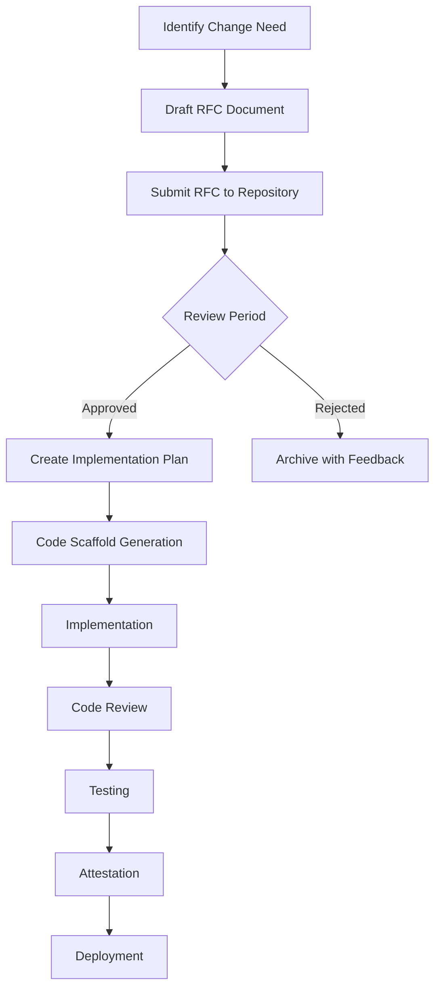

# ARCH Executor

> **Design Constraints and Operational Flow for Co-Piloted Orchestration**

---

## Overview

The ARCH Executor is the orchestration layer of the Omni-Tech Ascendancy Protocol (OTAP). It defines how AI-assisted development workflows integrate with human oversight, ensuring that all code changes, architectural decisions, and protocol updates follow a structured, auditable process.

---

## Design Constraints

### 1. Human-in-the-Loop

All critical decisions require human attestation before execution:

- **Code Deployments**: Smart contract deployments require explicit human approval
- **Token Operations**: Minting, burning, and transfers above threshold require multi-sig
- **Protocol Changes**: Governance updates require RFC approval and community vote

### 2. Immutable Audit Trail

Every action through ARCH Executor is recorded:

```
┌─────────────────────────────────────────────────────────────┐
│                    ATTESTATION RECORD                       │
├─────────────────────────────────────────────────────────────┤
│ Action ID:      0x7f3a...b2c1                               │
│ Timestamp:      2025-01-15T14:30:00Z                        │
│ Action Type:    CONTRACT_DEPLOY                             │
│ Initiator:      AI_COPILOT                                  │
│ Approver:       0x1234...5678 (ARCHITEX)                    │
│ Attestation:    APPROVED                                    │
│ Tx Hash:        0xabcd...ef01                               │
└─────────────────────────────────────────────────────────────┘
```

### 3. Role-Based Access Control

| Role       | Permissions                                      |
|------------|--------------------------------------------------|
| Seeker     | Read-only access, can submit RFCs                |
| Apprentice | Can create branches, submit PRs                  |
| Architect  | Can approve PRs, initiate deployments            |
| Sovereign  | Full access, can execute emergency overrides     |

### 4. Fail-Safe Mechanisms

- **Circuit Breakers**: Automatic halt on anomaly detection
- **Rate Limiting**: Throttle high-frequency operations
- **Rollback Capability**: Revert to previous known-good state

---

## Operational Flow

### RFC (Request for Change) Process



### RFC Document Template

```markdown
# RFC-[NUMBER]: [TITLE]

## Summary
Brief description of the proposed change.

## Motivation
Why is this change necessary?

## Design
Technical approach and architecture.

## Implementation Plan
Step-by-step implementation details.

## Security Considerations
Potential security implications.

## Backward Compatibility
Impact on existing functionality.

## Timeline
Estimated implementation timeline.

## Attestation Requirements
Required approvals and signatures.
```

---

## Code Scaffolds

ARCH Executor generates standardized code scaffolds for common patterns:

### Smart Contract Scaffold

```solidity
// SPDX-License-Identifier: MIT
pragma solidity ^0.8.24;

import "@openzeppelin/contracts/access/AccessControl.sol";
import "@openzeppelin/contracts/security/Pausable.sol";
import "@openzeppelin/contracts/security/ReentrancyGuard.sol";

/**
 * @title [CONTRACT_NAME]
 * @dev [DESCRIPTION]
 * @author OTAP - Generated by ARCH Executor
 */
contract [CONTRACT_NAME] is AccessControl, Pausable, ReentrancyGuard {
    // Role definitions
    bytes32 public constant ARCHITEX_ROLE = keccak256("ARCHITEX_ROLE");
    bytes32 public constant OPERATOR_ROLE = keccak256("OPERATOR_ROLE");

    // Events
    event ActionExecuted(address indexed executor, bytes32 indexed actionId);

    // State variables
    // [GENERATED_STATE]

    constructor() {
        _grantRole(DEFAULT_ADMIN_ROLE, msg.sender);
        _grantRole(ARCHITEX_ROLE, msg.sender);
    }

    // Core functions
    // [GENERATED_FUNCTIONS]

    // Emergency functions
    function pause() external onlyRole(ARCHITEX_ROLE) {
        _pause();
    }

    function unpause() external onlyRole(ARCHITEX_ROLE) {
        _unpause();
    }
}
```

### Test Scaffold

```javascript
const { expect } = require("chai");
const { ethers } = require("hardhat");

describe("[CONTRACT_NAME]", function () {
    let contract;
    let owner, user1, user2;

    beforeEach(async function () {
        [owner, user1, user2] = await ethers.getSigners();
        const Factory = await ethers.getContractFactory("[CONTRACT_NAME]");
        contract = await Factory.deploy();
        await contract.waitForDeployment();
    });

    describe("Deployment", function () {
        it("Should set the correct admin", async function () {
            // [GENERATED_TESTS]
        });
    });

    describe("Core Functions", function () {
        // [GENERATED_TESTS]
    });

    describe("Access Control", function () {
        // [GENERATED_TESTS]
    });
});
```

---

## Attestation Protocol

### On-Chain Attestation

Critical operations require on-chain attestation:

```solidity
interface IAttestation {
    struct AttestationData {
        bytes32 actionId;
        address attester;
        uint256 timestamp;
        bytes signature;
        AttestationType attestationType;
    }

    enum AttestationType {
        APPROVAL,
        REJECTION,
        ABSTAIN
    }

    event AttestationRecorded(
        bytes32 indexed actionId,
        address indexed attester,
        AttestationType attestationType
    );

    function attest(
        bytes32 actionId,
        AttestationType attestationType,
        bytes calldata signature
    ) external;

    function getAttestation(bytes32 actionId) 
        external view returns (AttestationData memory);
}
```

### Off-Chain Verification

For non-critical operations, off-chain verification is used:

1. **Signature Collection**: Gather required signatures from authorized parties
2. **Threshold Check**: Verify minimum signature threshold is met
3. **Execution**: Proceed with operation if threshold is satisfied
4. **Logging**: Record attestation in centralized logs with hash anchoring

---

## Integration Points

### CI/CD Pipeline

ARCH Executor integrates with CI/CD through:

```yaml
# .github/workflows/arch-executor.yml
name: ARCH Executor Checks

on:
  pull_request:
    types: [opened, synchronize]

jobs:
  validate-rfc:
    runs-on: ubuntu-latest
    steps:
      - uses: actions/checkout@v4
      - name: Validate RFC Format
        run: |
          # Check RFC document structure
          # Verify required sections present

  check-attestation:
    runs-on: ubuntu-latest
    steps:
      - uses: actions/checkout@v4
      - name: Verify Attestation Requirements
        run: |
          # Check if required approvals are in place
          # Validate signature threshold
```

### External Systems

- **Governance Portal**: Submit and vote on RFCs
- **Monitoring Dashboard**: Real-time operation tracking
- **Alert System**: Notifications for pending attestations

---

## Security Considerations

### Threat Model

| Threat                  | Mitigation                              |
|-------------------------|----------------------------------------|
| Unauthorized execution  | Role-based access + attestation        |
| Key compromise          | Multi-sig + time-locks                 |
| AI hallucination        | Human verification required            |
| Replay attacks          | Nonce-based action IDs                 |

### Audit Requirements

- All ARCH Executor code changes require security review
- Quarterly penetration testing
- Bug bounty program for critical vulnerabilities

---

## Persistent Incremental Improvements

ARCH Executor supports continuous improvement through:

1. **Metrics Collection**: Track operation success rates, latency, and errors
2. **Feedback Loops**: Incorporate user feedback into RFC process
3. **A/B Testing**: Safe experimentation with new features
4. **Gradual Rollouts**: Phased deployment to minimize risk

---

## References

- [OTAP-README.md](./OTAP-README.md) - Protocol overview
- [ROADMAP.md](./ROADMAP.md) - Development timeline
- [ASCENDANCYID-SPEC.md](./ASCENDANCYID-SPEC.md) - Identity NFT specification
