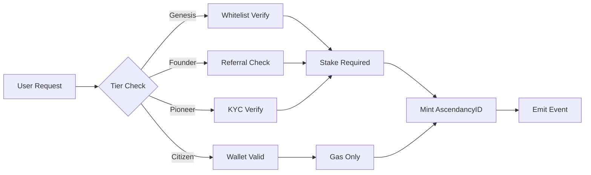

# OTAP Tokenomics

## RFC: AscendancyID Token Economics

**RFC Number:** OTAP-RFC-001  
**Title:** AscendancyID Token Economics and Governance Framework  
**Author:** OmniTech1 Protocol Team  
**Status:** Draft  
**Created:** 2025-11-26  
**Category:** Standards Track  

---

## Abstract

This document specifies the token economics (tokenomics) for the AscendancyID system within the OmniTech Ascendancy Protocol (OTAP). It defines the identity token schema, supply mechanisms, minting rules, soulbound options, revocation procedures, metadata standards, and governance primitives.

## Motivation

The ScrollVerse ecosystem requires a robust identity layer that:

1. Provides verifiable on-chain identity
2. Enables governance participation
3. Supports credential attestations
4. Maintains economic sustainability
5. Respects user sovereignty and privacy

## Specification

### 1. AscendancyID Schema

#### Token Standard
- **Base Standard:** ERC-721 (Non-Fungible Token)
- **Extensions:** ERC-4973 (Account-Bound Tokens) for soulbound mode
- **Network:** Scroll (primary), with bridges to Ethereum and Polygon

#### Token Structure

```solidity
struct AscendancyID {
    uint256 tokenId;           // Unique identifier
    address holder;            // Current owner address
    uint256 tier;              // Supply tier (1-4)
    uint256 mintTimestamp;     // Creation timestamp
    bool isSoulbound;          // Transfer restriction flag
    bytes32 metadataHash;      // IPFS/Arweave content hash
    uint256 governanceWeight;  // Voting power multiplier
    bool isRevoked;            // Revocation status
}
```

#### Metadata Schema (JSON)

```json
{
  "name": "AscendancyID #12345",
  "description": "OmniTech Ascendancy Protocol Identity Token",
  "image": "ipfs://Qm.../ascendancy-id-12345.png",
  "external_url": "https://scrollverse.io/identity/12345",
  "attributes": [
    {
      "trait_type": "Tier",
      "value": "Genesis"
    },
    {
      "trait_type": "Soulbound",
      "value": "Yes"
    },
    {
      "trait_type": "Governance Weight",
      "value": 100,
      "display_type": "number"
    },
    {
      "trait_type": "Mint Date",
      "value": 1732608000,
      "display_type": "date"
    },
    {
      "trait_type": "Attestation Count",
      "value": 5,
      "display_type": "number"
    }
  ],
  "properties": {
    "tier": "genesis",
    "attestations": [
      "did:web:omnitech1.io/credentials/identity/12345",
      "did:web:omnitech1.io/credentials/shahadah/12345"
    ],
    "linkedDID": "did:ethr:scroll:0x1234...abcd"
  }
}
```

### 2. Supply Tiers

The AscendancyID system uses a tiered supply model to balance scarcity with accessibility.

| Tier | Name | Max Supply | Governance Weight | Minting Period |
|------|------|-----------|-------------------|----------------|
| 1 | Genesis | 1,000 | 100x | Launch - Month 3 |
| 2 | Founder | 10,000 | 50x | Month 3 - Month 6 |
| 3 | Pioneer | 100,000 | 10x | Month 6 - Month 12 |
| 4 | Citizen | Unlimited | 1x | Month 12+ |

#### Total Initial Supply Cap
- **Hard Cap (Year 1):** 111,000 tokens
- **Soft Cap (Ongoing):** No limit for Citizen tier

#### Supply Distribution

```
┌─────────────────────────────────────────────────────────┐
│                  AscendancyID Supply                    │
├─────────────────────────────────────────────────────────┤
│  Genesis (1,000)     ███                         0.9%   │
│  Founder (10,000)    ██████████                  9.0%   │
│  Pioneer (100,000)   ████████████████████████   90.1%   │
│  Citizen (∞)         [Unlimited after Year 1]          │
└─────────────────────────────────────────────────────────┘
```

### 3. Minting Rules

#### Eligibility Requirements

| Tier | Requirements |
|------|-------------|
| Genesis | Whitelist + 1 ETH equivalent stake |
| Founder | Whitelist OR community referral + 0.1 ETH stake |
| Pioneer | KYC attestation + 0.01 ETH stake |
| Citizen | Valid wallet address + gas fees only |

#### Minting Process



#### Minting Fees

| Component | Genesis | Founder | Pioneer | Citizen |
|-----------|---------|---------|---------|---------|
| Protocol Fee | 0.5 ETH | 0.05 ETH | 0.005 ETH | 0 |
| Staking Requirement | 1 ETH | 0.1 ETH | 0.01 ETH | 0 |
| Gas (estimated) | ~0.01 ETH | ~0.01 ETH | ~0.01 ETH | ~0.01 ETH |

#### Fee Distribution

```
Protocol Fees Collected
        │
        ├── 40% → Treasury (DAO Governed)
        ├── 30% → Development Fund
        ├── 20% → Community Rewards Pool
        └── 10% → Insurance Reserve
```

### 4. Soulbound Mode

#### Overview

Soulbound AscendancyIDs are non-transferable tokens bound to a single address, providing stronger identity guarantees.

#### Soulbound Properties

| Property | Transferable | Soulbound |
|----------|-------------|-----------|
| Transfer | ✅ Allowed | ❌ Blocked |
| Sale | ✅ Allowed | ❌ Blocked |
| Delegate | ✅ Allowed | ✅ Allowed |
| Burn | ✅ By Owner | ✅ By Owner |
| Revoke | ✅ By Governance | ✅ By Governance |

#### Conversion Rules

- **Transferable → Soulbound:** Allowed (one-way, irreversible)
- **Soulbound → Transferable:** Not allowed
- **Default Mode:** User choice at mint time

#### Soulbound Benefits

1. **Enhanced Trust Score:** +25% credibility in matching
2. **Governance Bonus:** +10% voting weight
3. **Lower Insurance Requirement:** 50% reduction
4. **Priority Attestations:** Faster verification processing

### 5. Revocation

#### Revocation Triggers

| Trigger | Authority | Process |
|---------|-----------|---------|
| User Request | Token Holder | Immediate |
| Governance Vote | DAO (>66% majority) | 7-day timelock |
| Legal Compliance | Authorized Issuer | 48-hour notice |
| Security Breach | Emergency Council | Immediate |

#### Revocation Process

```solidity
// Revocation states
enum RevocationState {
    Active,           // Normal operation
    PendingRevocation, // In timelock period
    Revoked,          // Permanently revoked
    Suspended         // Temporarily disabled
}

// Revocation event
event AscendancyIDRevoked(
    uint256 indexed tokenId,
    address indexed holder,
    RevocationState newState,
    string reason,
    uint256 timestamp
);
```

#### Post-Revocation

- Token metadata updated with revocation status
- Governance weight set to 0
- Attestations linked to token marked as invalid
- Holder may appeal through governance process
- New AscendancyID may be minted after appeal period (90 days)

### 6. Metadata Fields

#### Core Fields (Required)

| Field | Type | Description |
|-------|------|-------------|
| `tokenId` | uint256 | Unique token identifier |
| `tier` | string | Supply tier name |
| `mintTimestamp` | uint256 | Unix timestamp of minting |
| `holder` | address | Current owner address |
| `isSoulbound` | boolean | Transfer restriction status |

#### Extended Fields (Optional)

| Field | Type | Description |
|-------|------|-------------|
| `displayName` | string | Human-readable name (encrypted) |
| `avatarURI` | string | Profile image URI |
| `linkedDID` | string | Associated DID identifier |
| `attestations` | string[] | Array of credential URIs |
| `socialLinks` | object | Verified social media links |
| `preferences` | object | User preference settings |

#### Privacy Considerations

- PII stored off-chain (IPFS/Arweave) with encryption
- On-chain data limited to hashes and public attributes
- Zero-knowledge proofs for selective disclosure (future)

### 7. Governance Primitives

#### Voting Power Calculation

```
Voting Power = Base Weight × Tier Multiplier × Soulbound Bonus × Time Factor

Where:
- Base Weight = 1
- Tier Multiplier = {Genesis: 100, Founder: 50, Pioneer: 10, Citizen: 1}
- Soulbound Bonus = {Yes: 1.1, No: 1.0}
- Time Factor = min(1.5, 1 + (days_held / 365) × 0.5)
```

#### Governance Actions

| Action | Quorum | Threshold | Timelock |
|--------|--------|-----------|----------|
| Parameter Change | 10% | 51% | 3 days |
| Treasury Spend (<$10K) | 5% | 51% | 1 day |
| Treasury Spend (>$10K) | 20% | 66% | 7 days |
| Protocol Upgrade | 25% | 75% | 14 days |
| Emergency Action | 1% | 90% | 0 days |

#### Delegation

- Voting power can be delegated to any valid address
- Delegation is revocable at any time
- Delegated votes do not transfer tier multipliers
- Self-delegation is the default state

### 8. Sample Economics

#### Year 1 Projections

| Metric | Conservative | Moderate | Optimistic |
|--------|-------------|----------|------------|
| Genesis Mints | 500 | 800 | 1,000 |
| Founder Mints | 3,000 | 6,000 | 10,000 |
| Pioneer Mints | 20,000 | 50,000 | 100,000 |
| Protocol Revenue | $125K | $350K | $750K |
| Treasury Value | $50K | $140K | $300K |

#### Token Value Drivers

1. **Utility Value:** Access to ecosystem services
2. **Governance Value:** Voting rights and influence
3. **Credential Value:** Attestation linkage
4. **Network Effects:** Growing ecosystem participation
5. **Scarcity:** Tiered supply limits

### 9. Issuance Schedule

#### Phase 1: Genesis Launch (Months 1-3)

```
Month 1: Genesis whitelist opens
         - Max 334 mints
         - Priority: Core contributors, partners

Month 2: Genesis public sale
         - Max 333 mints
         - First-come, first-served

Month 3: Genesis close, Founder opens
         - Final 333 Genesis mints
         - Founder whitelist begins
```

#### Phase 2: Founder Era (Months 3-6)

```
Month 3-4: Founder whitelist
           - Max 5,000 mints
           - Community referral program

Month 5-6: Founder public
           - Remaining 5,000 mints
           - Pioneer whitelist signup
```

#### Phase 3: Pioneer Expansion (Months 6-12)

```
Month 6-9: Pioneer early access
           - Max 50,000 mints
           - KYC integration launch

Month 9-12: Pioneer general
            - Remaining 50,000 mints
            - Citizen tier preparation
```

#### Phase 4: Citizen Era (Month 12+)

```
Month 12+: Citizen unlimited minting
           - No supply cap
           - Ongoing ecosystem growth
           - Governance fully active
```

### 10. Economic Sustainability

#### Revenue Streams

| Stream | Source | Allocation |
|--------|--------|------------|
| Minting Fees | New AscendancyID creation | Treasury (40%) |
| Transaction Fees | Marketplace trades | Development (30%) |
| Service Fees | Premium features | Rewards (20%) |
| Staking Returns | DeFi integrations | Insurance (10%) |

#### Sustainability Mechanisms

1. **Treasury Diversification:** Multi-asset holdings
2. **Burn Mechanism:** 1% of fees burned quarterly
3. **Inflation Control:** Citizen tier capped at 10% annual growth
4. **Reserve Requirements:** 6-month operational runway minimum

---

## Rationale

The tiered supply model balances:
- **Early adopter incentives** through Genesis/Founder scarcity
- **Broad accessibility** through Pioneer/Citizen availability
- **Governance stability** through weighted voting
- **Economic sustainability** through diversified revenue

## Backwards Compatibility

This specification is compatible with:
- ERC-721 standard interfaces
- ERC-4973 soulbound token standard
- Existing ScrollVerse smart contracts
- W3C Verifiable Credentials for attestations

## Security Considerations

1. **Sybil Resistance:** Tiered minting with KYC prevents mass creation
2. **Governance Attacks:** High quorums and timelocks protect treasury
3. **Key Management:** HSM-backed signing for protocol operations
4. **Revocation:** Multi-sig and timelock for irreversible actions

## References

- [EIP-721: Non-Fungible Token Standard](https://eips.ethereum.org/EIPS/eip-721)
- [EIP-4973: Account-bound Tokens](https://eips.ethereum.org/EIPS/eip-4973)
- [W3C Verifiable Credentials](https://www.w3.org/TR/vc-data-model/)
- [ScrollVerse Whitepaper](./SCROLLCHAIN_WHITEPAPER.md)

---

**Document Version:** 1.0.0  
**Last Updated:** 2025-11-26  
**Status:** Draft - Open for Community Review  

*This document is part of the OmniTech Ascendancy Protocol (OTAP) specification.*
